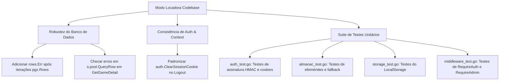

# Plano de Avaliação e Melhorias no Código Go (GoDoctor & Arquitetura)

Este documento apresenta a avaliação técnica do código Go do **Modo Locadora** com base nos padrões do `godoctor`, nas convenções de Go idiomático e no fluxo de engenharia do repositório.

---

## 1. Diagnóstico Geral do Código Go

| Área / Critério | Status | Observações |
|---|---|---|
| **Compilação e AST** | ✅ Aprovado | `go build ./...` e `go vet ./...` rodam sem nenhum erro de compilação ou sintaxe. |
| **Padrões de Nomes e Anti-Stuttering** | ✅ Aprovado | Nomes concisos (`auth.SignCookie`, `storage.StorageProvider`, `database.Store`). |
| **Separação de Camadas** | ✅ Aprovado | Pacotes bem definidos sob `internal/`, sem pacotes genéricos (`utils`, `common`). |
| **HTTP Routing** | ✅ Aprovado | Uso de `net/http.ServeMux` nativo do Go 1.22+ com verbos e path parameters (`GET /clubs/{id}`). |
| **Tratamento de Erros e Iterações SQL** | ⚠️ Atenção | Métodos com queries de múltiplas linhas (`pgx.Rows`) não checam `rows.Err()`. Em falha de rede/streaming, linhas parciais podem ser aceitas silenciosamente. |
| **Erros Silenciados em Queries** | ⚠️ Atenção | Em `GetGameDetail` ([postgres.go](file:///home/cmellojr/modo-locadora/internal/database/postgres.go#L283-L305)), `s.pool.QueryRow(...).Scan(...)` é chamado sem checagem de erros. |
| **Consistência de Autenticação** | ⚠️ Atenção | O middleware `RequireAuth` injeta o `member_id` no contexto da requisição (`middleware.MemberIDFromContext`), mas handlers reprocessam o cookie manualmente com `auth.GetSessionMemberID(r, ...)`. Além disso, `h.Logout` redeclara a limpeza do cookie em vez de usar `auth.ClearSessionCookie`. |
| **Cobertura de Testes Automatizados** | 🔴 Crítico | **Zero testes unitários** no repositório inteiro (`[no test files]` em todos os pacotes). Qualquer refatoração ou evolução corre risco de regressão. |

---

## 2. Pontos Críticos e Mudanças Propostas



---

## 3. Detalhamento das Alterações

### Componente 1: Robustez no Banco de Dados (`internal/database/postgres.go`)

#### [MODIFY] [internal/database/postgres.go](file:///home/cmellojr/modo-locadora/internal/database/postgres.go)

1. **Adicionar checagem de `rows.Err()`** em todas as funções que iteram sobre `pgx.Rows`:
   - `ListGames`
   - `ListGamesWithAvailability`
   - `ListPlatforms`
   - `ListActiveRentals`
   - `ProcessOverdueRentals`
   - `GetTopShameEntries`
   - `ListRecentActivities`
   - `ListMemberActiveRentals`
   - `ListCompletedGameIDs`
   - `ListClubs`
   - `GetClubDetail`
   - `ListMemberClubs`
   - `ListGamesWithPopularity`
   - `ListGameRentalHistory`

   *Exemplo:*
   ```go
   for rows.Next() {
       // scan ...
   }
   if err := rows.Err(); err != nil {
       return nil, fmt.Errorf("error iterating rows: %w", err)
   }
   ```

2. **Checar erros de `QueryRow().Scan()` em `GetGameDetail`**:
   Atualmente:
   ```go
   // Linhas 283-305
   s.pool.QueryRow(ctx, `SELECT COUNT(*) FROM rentals r ...`).Scan(&gd.TotalRentals)
   s.pool.QueryRow(ctx, `SELECT m.profile_name ...`).Scan(&gd.TopRenterName, &gd.TopRenterCount)
   s.pool.QueryRow(ctx, `SELECT m.profile_name ...`).Scan(&gd.CurrentRenter)
   ```
   *Melhoria*: Tratar erros que não sejam `pgx.ErrNoRows` (e ignorar silenciosamente apenas `pgx.ErrNoRows`, onde o default vazio/zero é o comportamento esperado).

---

### Componente 2: Consistência no Auth e Handlers (`internal/handlers/handler.go`)

#### [MODIFY] [internal/handlers/handler.go](file:///home/cmellojr/modo-locadora/internal/handlers/handler.go)

1. **Usar `auth.ClearSessionCookie(w)` em `Logout`**:
   - Atualmente, `Logout` recria manualmente o header `http.SetCookie(w, &http.Cookie{Name: "session_member", ...})`.
   - Deve chamar a função existente `auth.ClearSessionCookie(w)`.

---

### Componente 3: Criação da Suíte de Testes Unitários

Para atender às diretrizes do `godoctor` e garantir segurança com pipelines de CI, propõe-se a criação dos primeiros testes unitários em pacotes independentes de banco externo:

#### [NEW] [internal/auth/auth_test.go](file:///home/cmellojr/modo-locadora/internal/auth/auth_test.go)
- Testes unitários para `SignCookie` e `VerifyCookie` (assinatura válida, chave adulterada, valor adulterado, formato malformado).
- Testes para `SetSessionCookie`, `GetSessionMemberID` e `ClearSessionCookie` usando `httptest.NewRecorder` e `httptest.NewRequest`.

#### [NEW] [internal/almanac/almanac_test.go](file:///home/cmellojr/modo-locadora/internal/almanac/almanac_test.go)
- Teste para `TodaysEphemeride()` garantindo que retorna uma string não vazia em qualquer dia do ano, incluindo o fallback para efemérides genéricas.

#### [NEW] [internal/storage/local_storage_test.go](file:///home/cmellojr/modo-locadora/internal/storage/local_storage_test.go)
- Teste de `Save` e `Delete` do `LocalStorage` utilizando diretório temporário (`t.TempDir()`), garantindo que a criação de pastas e arquivos funciona sem efeitos colaterais.

#### [NEW] [internal/middleware/middleware_test.go](file:///home/cmellojr/modo-locadora/internal/middleware/middleware_test.go)
- Testes unitários para `RequireAuth`:
  - Bloqueio e redirect `StatusSeeOther` quando não há cookie de sessão.
  - Bloqueio quando a assinatura do cookie é inválida.
  - Sucesso e propagação do `member_id` via contexto para o próximo handler.

---

## 4. Plano de Verificação

### Testes Automatizados
```bash
# Executar a nova suíte de testes unitários com cobertura
go test -v -cover ./...

# Validar compilação e verificação de tipagem estática
go vet ./...
go build ./...
```

### Validação do Docker & Servidor
```bash
# Garantir que o container continua buildando perfeitamente
docker compose build app
```

---

## 5. Estratégia Git (git-workflow-and-versioning)

- **Branch**: Trabalho realizado na branch `develop` (ou branch dedicada `refactor/go-quality-improvements`).
- **Commits Atômicos**:
  1. `refactor(database): check rows.Err and query scan errors in postgres store`
  2. `refactor(handlers): reuse auth.ClearSessionCookie in Logout handler`
  3. `test(auth,almanac,storage,middleware): add unit test suites for core packages`
